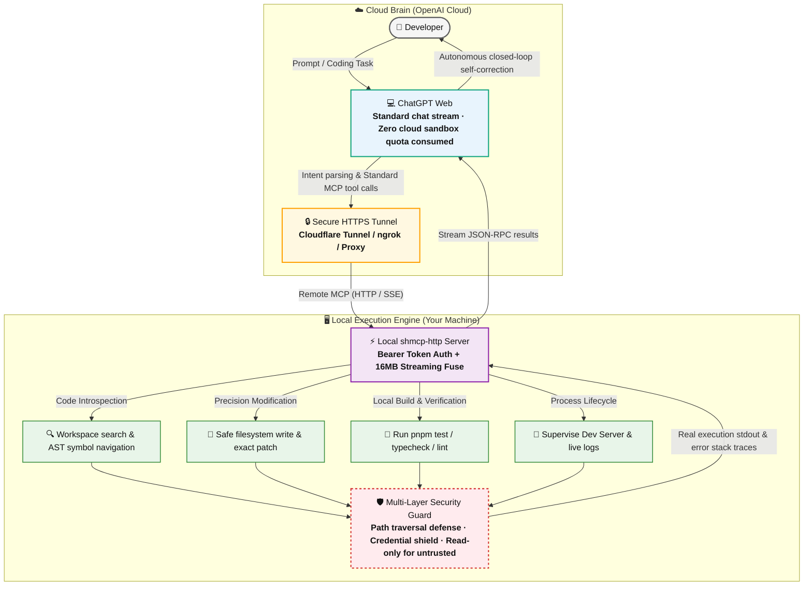

# local-mcp

[English](./README.md) | [简体中文](./README.zh-CN.md)

A secure local developer runtime and Model Context Protocol (MCP) server for AI-assisted coding on macOS and other Unix-like development environments.

`local-mcp` gives AI clients structured access to local projects without exposing an unrestricted shell. It combines project trust, filesystem confinement, safe Git reads, controlled task execution, Developer Runtime state, workspace snapshots, and stdio/HTTP MCP transports.

## Status

This project is currently in early development (`0.1.0`). The security model is intentionally conservative and may evolve before a stable release.

## Features

- Project registration, discovery, trust and permission management
- Safe filesystem browsing, search, reading, writing and exact text replacement
- Protected path rules for `.git`, `.env`, private keys, `.shmcp.yaml` and other sensitive files
- Safe Git status, diff and log operations with external diff/textconv/fsmonitor protections
- Restricted task execution using structured `program + args` instead of shell command strings
- Project-root anchored executable allowlists
- Test, typecheck and lint execution
- Package script discovery and controlled execution
- Symbol definition/reference lookup
- Developer Runtime process management with `dev_start`, `dev_logs`, `dev_stop` and `dev_list`
- Workspace snapshots, restore previews and controlled restore
- Security scanning for risky project configuration and suspicious code patterns
- MCP over stdio and HTTP
- Loopback Host/Origin/Referer/Fetch-Metadata checks for local HTTP mode
- Request body, rate-limit, process-output and runtime resource limits

---

## 💡 Killer Feature: Seamless ChatGPT Web Integration (Unlimited Coding Without 5-Hour Caps)

When using **ChatGPT Web** for deep coding assistance, developers commonly face two bottlenecks:
1. **Usage limits**: Cloud-based Advanced Data Analysis (Code Interpreter) burns through strict **5-hour rate limits**, causing popup lockouts that disrupt workflow.
2. **Environment isolation**: Cloud sandboxes cannot directly read, write, or run tests on your local machine, forcing frustrating manual copy-pasting.

### How Does `local-mcp` Enable Unlimited Coding?

`local-mcp` connects ChatGPT Web to your local projects using a **"Cloud Reasoning Brain + Local Execution Engine"** architecture:



- **Zero Cloud Sandbox Consumption**: All file indexing, precise syntax patching, type checking, test runs, and dev server supervision occur **directly on your local computer**. It does not consume OpenAI's cloud container resources.
- **Continuous All-Day Workflow**: To ChatGPT Web, this operates through standard text/tool conversation streams, **completely bypassing the strict 5-hour code execution limits** so you can refactor, write features, and debug without interruption.
- **Instant WYSIWYG Feedback**: ChatGPT modifies code locally and runs test suites immediately, inspecting error stack traces and self-correcting autonomously without manual intervention.

---

## Security model

The project is designed around four layers:

```text
Global policy
    ↓
Project trust and project policy
    ↓
Developer Runtime
    ↓
Filesystem / Git / process / MCP tools
```

### Project trust

Newly registered and auto-discovered projects are untrusted by default.

An untrusted project is treated as read-only:

- filesystem reads may be allowed by policy
- writes and deletes are disabled
- shell/task execution is disabled
- workspace restore is disabled
- repository-provided `AGENTS.md` content is not automatically injected into project context

Trust must be granted locally through the CLI:

```bash
shcli project trust <name>
```

Trust can be revoked with:

```bash
shcli project untrust <name>
```

### Restricted execution is not a sandbox

Restricted mode limits executable resolution, arguments, environment variables and project-local executables. It does **not** provide operating-system sandboxing.

Package managers and build tools can execute project code. Task execution therefore still requires an explicitly trusted project.

### Protected files

Default protected patterns include:

```text
.git
.git/**
.vscode/**
.idea/**
.env
.env.*
*.pem
*.key
*.p12
*.pfx
id_rsa
id_ed25519
.shmcp.yaml
```

Protected files cannot be read or modified through normal filesystem MCP tools.

## Requirements

- Node.js `>= 22.12.0`
- pnpm
- macOS or another Unix-like development environment is the primary target

Optional tools such as Git, ripgrep, Go, Swift, Flutter or Gradle are required only for the related project features.

## Development

Install dependencies:

```bash
pnpm install --frozen-lockfile
```

Run the checks:

```bash
pnpm test
pnpm typecheck
pnpm build
```

Clean generated output:

```bash
pnpm clean
```

## CLI & MCP Server

The management CLI is:

```bash
shcli
```

Useful management commands include:

```bash
shcli project add <path>
shcli project list
shcli project trust <name>
shcli project untrust <name>
shcli doctor
shcli config
```

The standalone stdio MCP server executable remains:

```bash
shmcp
```

## MCP stdio server

Connect AI clients (Claude Desktop, Cursor, etc.) directly using:

```bash
shmcp
```

For local development:

```bash
pnpm dev:mcp
```

### Installation via Smithery (One-Click)

To install for Claude Desktop or Cursor automatically via [Smithery](https://smithery.ai):

```bash
npx -y @smithery/cli install @shworks/local-mcp --client claude
```

## MCP HTTP server

The HTTP executable is:

```bash
shmcp-http
```

Default configuration:

```text
Host: 127.0.0.1
Port: 8787
```

Supported environment variables:

```text
MCP_HOST
MCP_PORT
MCP_AUTH_TOKEN
MCP_ALLOW_INSECURE_HTTP
MCP_MAX_BODY_BYTES
MCP_ALLOWED_HOSTS
```

`MCP_ALLOWED_HOSTS` is only for trusted HTTP Host values (for example, a reverse-proxy hostname). Authenticated MCP requests do not depend on browser `Origin` / `Referer` headers. Browser-source checks are enforced only for unauthenticated loopback mode.

Example:

```bash
MCP_AUTH_TOKEN="replace-with-a-strong-token" \
MCP_HOST="127.0.0.1" \
MCP_PORT="8787" \
shmcp-http
```

Non-loopback HTTP requires authentication. Plain HTTP on a non-loopback address is rejected by default and must be explicitly enabled with:

```bash
MCP_ALLOW_INSECURE_HTTP=1
```

For remote access, prefer an HTTPS reverse proxy instead of exposing plaintext HTTP.

### Connecting with ChatGPT Web (3 Steps to Unlimited Coding)

Connecting your local workspace to ChatGPT Web takes only three simple steps:

#### Step 1: Start `shmcp-http` with a Secure Auth Token

```bash
MCP_AUTH_TOKEN="set-your-strong-random-token" \
MCP_HOST="127.0.0.1" \
MCP_PORT="8787" \
shmcp-http
```

#### Step 2: Expose via Secure HTTPS Tunnel (Cloudflare Tunnel or ngrok)

Since ChatGPT Web runs in the cloud, expose your local port via a secure tunnel:

```bash
# Using Cloudflare Tunnel (cloudflared):
cloudflared tunnel --url http://127.0.0.1:8787

# Or using ngrok:
ngrok http 8787
```
You will receive a public HTTPS URL such as `https://your-tunnel.trycloudflare.com`.

#### Step 3: Create a Dedicated Assistant via GPTs Editor (Official Method for Plus / Team)

> 💡 **Important Note**: In ChatGPT Plus Web, global MCP tools cannot be attached directly in generic chat windows. The official, stable way supported by OpenAI is creating a dedicated assistant via **My GPTs**:

1. Open the official GPT Editor in your browser: [https://chatgpt.com/gpts/editor](https://chatgpt.com/gpts/editor).
2. Switch to the **Configure** tab:
   - **Name**: Enter `Local Dev Assistant` (or your preferred name).
   - **Instructions**: Add a concise prompt, e.g.:
     > "You are an expert full-stack local coding assistant. Always use the connected local MCP tools to inspect code, edit files, and execute tests before answering."
3. Scroll down to the bottom, find **Actions**, and click **Create new action**:
   - **Authentication**: Select **API Key**, Auth Type **Bearer**, and enter the `MCP_AUTH_TOKEN` from Step 1.
   - **Schema**: Click **Import from URL** and enter `https://your-tunnel.trycloudflare.com/openapi.json` (ChatGPT will automatically import the OpenAPI 3.1.0 schema).
4. In the top-right corner, click **Create / Update** and choose **Only me** to save.
5. **Start Unlimited Pairing**:
   - In the ChatGPT Web sidebar, click on your newly created custom GPT at any time.
   - Pair-program naturally in the browser chat:
     > *"Inspect our project README, find uncovered edge cases in packages/core, apply fixes, and run pnpm test to verify!"*

All reasoning flows through standard chat, while code execution and test verification run on your local machine **without burning through strict 5-hour Code Interpreter quotas**!

---

## Project configuration

Projects may define `.shmcp.yaml` for controlled tasks and project-specific restrictions.

Example:

```yaml
permissions:
  read: true
  write: true
  delete: false
  shell: restricted

commands:
  test:
    program: pnpm
    args: ["test"]
    cwd: "."
    timeoutMs: 120000

  typecheck:
    program: pnpm
    args: ["typecheck"]
    cwd: "."
    timeoutMs: 120000

  build:
    program: pnpm
    args: ["build"]
    cwd: "."
    timeoutMs: 180000
```

A project configuration can restrict the global policy further, but cannot elevate permissions beyond the global policy.

`.shmcp.yaml` itself is protected and symbolic links are rejected.

## Developer Runtime

Stateful tools use a Developer Runtime to keep bounded local state such as:

- recent test results
- managed development processes
- workspace snapshots

Runtime resources are bounded and can be reset without changing project files outside the controlled restore mechanism.

Representative tools include:

```text
test_run
test_failures
typecheck
lint
symbol_definition
symbol_references
dev_start
dev_list
dev_logs
dev_stop
package_scripts
package_run_script
workspace_snapshot
workspace_snapshot_list
workspace_restore_preview
workspace_restore
security_scan
runtime_status
runtime_capabilities
runtime_reset
```

## Installation & Release Gate

Currently, build the project from source or link globally using pnpm.

Before creating a release, the intended release gate is:

```bash
pnpm install --frozen-lockfile
pnpm test
pnpm typecheck
pnpm build
```

A release should use an immutable Git tag and source archive with a verified SHA-256 checksum.

## Reporting security issues

Please avoid publishing exploitable security issues in a public issue before a fix is available. If a private security reporting channel is configured for the repository, use that channel first.

## Discovery & Machine Introspection

The HTTP server provides standard machine-readable discovery endpoints so AI clients, reverse proxies, and developer portals can discover server capabilities automatically:

| Endpoint | Method | Purpose | Authentication |
| :--- | :--- | :--- | :--- |
| `/` | `GET` | Service landing status and endpoint directory | Public |
| `/healthz` | `GET` | Health check probe | Public |
| `/openapi.json` | `GET` | OpenAPI 3.1.0 specification (for ChatGPT Custom Actions 1-click import) | Public |
| `/.well-known/openapi.json` | `GET` | RFC-style well-known OpenAPI specification endpoint | Public |
| `/.well-known/mcp.json` | `GET` | MCP protocol metadata and transport configuration | Public |
| `/mcp` | `POST` | JSON-RPC 2.0 protocol endpoint | Bearer Token |

### GitHub Topics for Discovery

When hosting on GitHub, add these repository topics to ensure automated crawlers (Smithery, PulseMCP, Glama) index your server:
`mcp`, `mcp-server`, `model-context-protocol`, `chatgpt-actions`, `claude-desktop`, `cursor`, `developer-tools`

## License

Licensed under the Apache License, Version 2.0. See [LICENSE](./LICENSE).
