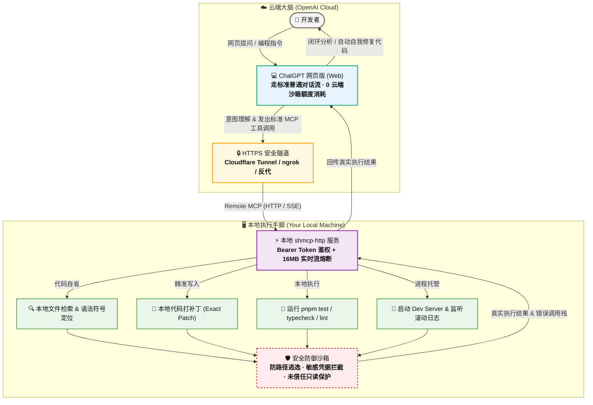

# local-mcp

[English](./README.md) | [简体中文](./README.zh-CN.md)

专为 macOS 及类 Unix 开发环境打造的**本地安全开发者运行时与 Model Context Protocol (MCP) 服务端**，赋能 AI 辅助编程与自动化工程协同。

`local-mcp` 允许 AI 客户端以受控、结构化的方式访问本地工程，而**无需暴露任何不受限制的交互式 Shell 权限**。它深度整合了工程信任机制、文件系统沙箱限制、安全 Git 只读操作、受限任务执行、Developer Runtime 状态容器、工作区快照以及 stdio / HTTP 双模式 MCP 传输通道。

## 项目状态

当前项目处于早期演进阶段 (`0.1.0`)。我们采取了极度审慎且严密的安全防御模型，该模型将在正式稳定版本发布前持续演进加固。

## 核心特性

- **工程管理**：工程注册、自动发现、信任分级（Trust）与权限动态控制
- **安全文件系统**：只读浏览、全文检索、精确文本替换、受限安全写入与二次父目录解析
- **敏感路径保护**：强制保护 `.git`、`.env`、私钥证书、`.shmcp.yaml` 等敏感工程元数据
- **安全 Git 审计**：受控的 status / diff / log 操作，强制禁用外部恶意 diff/textconv/fsmonitor 脚本执行
- **受限任务执行**：采用结构化 `program + args` 参数数组代替危险的 Shell 字符串拼接执行
- **程序白名单**：严格的系统受信目录白名单与工程根目录锚定执行权限
- **质量保障**：自动化测试、类型检查 (typecheck) 与代码规范检查 (lint) 一键运行
- **包脚本解析**：自动探测 package scripts 并提供可审计的受限执行
- **代码自省**：符号定义、引用溯源与轻量 AST 级语义导航
- **开发者运行时 (Developer Runtime)**：提供 `dev_start`、`dev_logs`、`dev_stop`、`dev_list` 进程管理与状态隔离
- **工作区快照**：支持工作区快照备份、回滚影响预览（Restore Preview）与精准可控恢复
- **安全扫描**：静态扫描项目中的高风险配置与潜在恶意代码模式
- **双模 MCP 传输**：原生支持 stdio 与 HTTP (Server-Sent Events) 双通道
- **本地回环防御**：HTTP 模式下强制校验 Host、Origin、Referer 与 Fetch-Metadata，杜绝 DNS Rebinding 攻击
- **资源与容量边界**：请求体限制（默认 16MB 实时分块熔断）、IP 限流、进程输出上限及内存环形缓冲

---

## 💡 核心杀手锏：完美支持 ChatGPT 网页版（无限工作，彻底打破 5 小时额度瓶颈）

以往在 **ChatGPT 网页版** 中进行深度编程辅助时，开发者常常遇到两大痛点：
1. **额度限制**：使用官方云端高级代码分析（Code Interpreter）会迅速消耗严格的**每 5 小时对话次数上限**，写一会儿代码就会弹窗被锁，打断工作流。
2. **环境孤岛**：云端沙箱无法直接读取、修改你电脑上的真实工程，反复手动复制粘贴代码效率极其低下。

### 为什么能实现“无限工作，不消耗五小时额度”？

`local-mcp` 采用了 **“云端推理大脑 + 本地执行手脚”** 的协同架构：



- **零云端沙箱消耗**：所有的文件检索、精准代码打补丁、类型检查、单元测试、本地服务器管理全部在**你自己的电脑**上执行，不占用 OpenAI 的云端算力容器。
- **长效持续协同**：在 ChatGPT 网页版中，它仅表现为普通的标准消息对话与 JSON 工具交互，**完全避开官方云端代码解释器的严苛 5 小时使用额度**，助你一整天持续高效重构、写代码、排查 Bug。
- **所见即所得**：ChatGPT 提出修改建议后直接在本地落地并运行测试，立刻读取测试报错自动自我修复，无需任何手动拷贝。

---

## 安全模型

架构围绕以下四层纵深防御体系设计：

```text
全局安全策略 (Global policy)
    ↓
工程信任与工程局部策略 (Project trust & local policy)
    ↓
开发者运行时 (Developer Runtime)
    ↓
文件系统 / Git / 进程执行 / MCP 工具集
```

### 工程信任机制 (Project Trust)

所有新注册或自动发现的工程**默认均为未受信任状态 (Untrusted)**。

未受信任的工程被严格限制为**只读沙箱模式**：

- 仅允许按照全局策略进行常规文件读取
- 严禁任何文件写入与删除操作
- 严禁执行任何 Shell 或构建任务
- 严禁执行工作区快照恢复
- 工程内置的 `AGENTS.md` 说明文件将被隐匿，防止提示词注入 (Prompt Injection)

必须在本地终端通过 CLI 显式授予信任：

```bash
shcli project trust <工程名>
```

亦可随时撤销信任：

```bash
shcli project untrust <工程名>
```

### 受限执行模式并非 OS 级沙箱

受限模式限制了可执行文件路径解析、参数格式、环境变量清洗以及本地可执行文件的执行范围。它**并不**等同于操作系统内核级的严格沙箱容器（如 Docker 或 macOS Sandbox-Exec）。

包管理器和编译构建工具天然具备执行项目内部脚本的能力。因此，**任务执行始终强制要求工程处于已信任状态**。

### 受保护文件与敏感规则

默认内置的受保护通配规则包括：

```text
.git
.git/**
.vscode/**
.idea/**
.env
.env.*
*.pem
*.key
*.p12
*.pfx
id_rsa
id_ed25519
.shmcp.yaml
```

受保护的文件严禁通过普通文件系统 MCP 工具进行读取、修改或覆盖。

## 环境要求

- **Node.js**：`>= 22.12.0`
- **包管理器**：`pnpm`
- **操作系统**：以 macOS 及主流 Unix-like 开发环境为首要适配目标

*注：Git、ripgrep、Go、Swift、Flutter、Gradle 等第三方工具仅在涉及对应语言/功能时按需依赖。*

## 本地开发指南

安装工程依赖：

```bash
pnpm install --frozen-lockfile
```

运行工程检查套件：

```bash
pnpm test          # 自动化单元测试
pnpm typecheck     # TypeScript 严格类型检查
pnpm build         # 全量编译构建
```

清理编译生成物：

```bash
pnpm clean
```

## CLI 命令行工具与 MCP 服务

工程管理 CLI 为：

```bash
shcli
```

工程管理常用指令一览：

```bash
shcli project add <路径>      # 注册新工程
shcli project list           # 列出所有已注册工程
shcli project trust <工程名>   # 授予工程受信任状态
shcli project untrust <工程名> # 撤销工程信任
shcli doctor                 # 检测本地开发环境依赖与健康状态
shcli config                 # 查看当前全局配置
```

独立的 stdio MCP 服务端可执行程序仍为：

```bash
shmcp
```

## MCP stdio 服务端

供 Claude Desktop、Cursor、VS Code 等本地 AI 宿主使用的可执行程序为：

```bash
shmcp
```

本地开发调试模式：

```bash
pnpm dev:mcp
```

### 通过 Smithery 一键安装

支持通过 [Smithery](https://smithery.ai) 自动为 Claude Desktop 或 Cursor 进行一键安装：

```bash
npx -y @smithery/cli install @shworks/local-mcp --client claude
```

## MCP HTTP 服务端

面向远程或网络调用的 HTTP 服务端可执行程序为：

```bash
shmcp-http
```

默认服务配置：

```text
Host: 127.0.0.1
Port: 8787
Endpoint: http://127.0.0.1:8787/mcp
```

支持的环境变量配置：

| 环境变量 | 默认值 | 作用说明 |
| :--- | :--- | :--- |
| `MCP_HOST` | `127.0.0.1` | 监听绑定的网络地址 |
| `MCP_PORT` | `8787` | 监听绑定的端口号 |
| `MCP_AUTH_TOKEN` | *(空)* | Bearer Token 访问密钥（非回环地址强制要求） |
| `MCP_ALLOW_INSECURE_HTTP` | `0` | 是否显式允许在非回环地址上使用明文 HTTP |
| `MCP_MAX_BODY_BYTES` | `16777216` (16MB) | 单次请求体最大字节限制（支持流式 chunked 熔断） |
| `MCP_ALLOWED_HOSTS` | *(空)* | 受信任的 Host 白名单，多个以英文逗号分隔，仅用于 Host header / 反向代理校验 |
| `MCP_ALLOW_QUERY_TOKEN` | `0` | 是否允许通过 URL Query 传递鉴权 Token（如 `/mcp?token=xxx`，适用于 Claude.ai Web） |

启动范例：

```bash
MCP_AUTH_TOKEN="your-secure-random-token" \
MCP_HOST="127.0.0.1" \
MCP_PORT="8787" \
shmcp-http
```

> **安全须知**：
> - 监听任何非 loopback 地址（如 `0.0.0.0`）时，必须配置 `MCP_AUTH_TOKEN` 认证，否则启动直接报错退出。
> - 在非本机地址上暴露明文 HTTP 存在窃听隐患，默认拒绝启动，除非显式配置 `MCP_ALLOW_INSECURE_HTTP=1`。生产环境强烈建议通过 HTTPS 反向代理（如 Nginx、Caddy）部署。

### 接入 ChatGPT 网页版完整配置指引（3 步开启无限编程）

只需三步，即可将本地工程挂载到 ChatGPT 网页版：

#### 第 1 步：本地启动 `shmcp-http` 并配置强密钥

```bash
MCP_AUTH_TOKEN="set-your-strong-random-token" \
MCP_HOST="127.0.0.1" \
MCP_PORT="8787" \
shmcp-http
```

#### 第 2 步：配置安全公网 HTTPS 访问（推荐 Cloudflare Tunnel / ngrok）

由于 ChatGPT 网页端运行在公网云端，需要通过 HTTPS 安全隧道连接你本机的 `shmcp-http`：

```bash
# 推荐使用免费快速的 Cloudflare Tunnel (cloudflared)：
cloudflared tunnel --url http://127.0.0.1:8787

# 或者使用 ngrok：
ngrok http 8787
```
你会获得一个类似 `https://your-tunnel.trycloudflare.com` 的 HTTPS 域名。

#### 第 3 步：通过 GPTs 编辑器创建专属助手（Plus / Team 用户官方标准方式）

> 💡 **重要说明**：ChatGPT Plus 网页版在普通对话框中无法直接挂载全局 MCP，OpenAI 官方支持的标准方式是通过 **My GPTs** 自定义助手接入：

1. 浏览器直接访问官方 GPT 编辑器：[https://chatgpt.com/gpts/editor](https://chatgpt.com/gpts/editor)。
2. 切换到 **Configure（配置）** 标签页：
   - **Name**：填入 `本地代码助手`（或自定义名称）。
   - **Instructions**：填入简短指导词，如：
     > “你是一个专业的全栈本地协同开发专家，请优先通过已连接的本地 MCP 工具自省代码、修改文件并运行测试验证结果。”
3. 滚动到页面底部，找到 **Actions（操作）**，点击 **Create new action**（创建新操作）：
   - **Authentication（身份验证）**：选择 **API Key**，Auth Type 选 **Bearer**，填入第 1 步中设置的 `MCP_AUTH_TOKEN`。
   - **Schema（规范定义）**：点击 **Import from URL（从 URL 导入）** 并填入：`https://your-tunnel.trycloudflare.com/openapi.json`（ChatGPT 将全自动解析接口与入参结构）。
4. 点击右上角 **Create / Update** 按钮，发布范围选择 **Only me（仅自己可见）** 保存。
5. **开始无限协同编程**：
   - 在 ChatGPT 网页端左侧边栏，随时点击进入刚才创建的专属 GPT。
   - 像真人结对一样直接在聊天框下达指令：
     > *“请查看我们工程的 README，帮我定位 packages/core 中未被覆盖的边界用例，写好补丁并运行 pnpm test 验证！”*

所有的分析、改动和测试直接实时发生在你眼前的电脑上，**不消耗官方代码解释器的 5 小时次数上限**，更无需离开舒适的 ChatGPT 网页端！

---

## 工程个性化配置 (`.shmcp.yaml`)

工程可在根目录下放置 `.shmcp.yaml`，以定义受控命令白名单与工程级权限约束。

配置示例：

```yaml
permissions:
  read: true
  write: true
  delete: false
  shell: restricted

commands:
  test:
    program: pnpm
    args: ["test"]
    cwd: "."
    timeoutMs: 120000

  typecheck:
    program: pnpm
    args: ["typecheck"]
    cwd: "."
    timeoutMs: 120000

  build:
    program: pnpm
    args: ["build"]
    cwd: "."
    timeoutMs: 180000
```

- 工程级配置**只能在全局策略之上做进一步收紧，严禁越权提升权限**。
- `.shmcp.yaml` 本身受到绝对保护，禁止通过 MCP 接口进行修改，且坚决拒绝解析软链接。

## 开发者运行时 (Developer Runtime)

有状态工具依托 Developer Runtime 在内存中维护隔离且有界的上下文：

- 最近运行的测试结果与失败详情
- 受管的后台子进程生命周期
- 工作区快照元数据与差异记录

运行时资源具备严格的容量上限与内存环形缓冲，可一键重置（Reset），不影响工程物理磁盘状态。

核心 MCP 工具列表：

```text
test_run                  # 运行指定测试任务
test_failures             # 查询最近测试失败信息
typecheck                 # 执行类型检查
lint                      # 执行代码规范检查
symbol_definition         # 跳转符号定义
symbol_references         # 查询符号引用
dev_start                 # 启动后台开发服务器或进程
dev_list                  # 查看当前受管进程列表
dev_logs                  # 获取进程最新滚动日志
dev_stop                  # 优雅停止开发进程
package_scripts           # 探测并列出包定义脚本
package_run_script        # 受控执行包脚本
workspace_snapshot        # 创建当前工作区文件快照
workspace_snapshot_list   # 查看已有快照列表
workspace_restore_preview # 预览快照回滚影响范围
workspace_restore         # 安全回滚工作区文件变更
security_scan             # 对工程进行配置与代码安全审计
runtime_status            # 查询运行时状态与指标
runtime_capabilities      # 查询当前运行时能力集合
runtime_reset             # 安全重置运行时状态与终止残留进程
```

## 安装与发布门禁

当前可通过源码克隆并使用 pnpm 进行构建与全局链接运行。

在创建任何正式 Release 前，必须通过以下发布门禁检查：

```bash
pnpm install --frozen-lockfile
pnpm test
pnpm typecheck
pnpm build
```

每个正式版本将使用不可变 Git Tag 以及带 SHA-256 校验的源码归档发布。

## 安全漏洞响应

若您在本项目中发现安全隐患或漏洞，请避免直接在公共 Issue 中公开可利用细节。请通过仓库配置的私密安全报告渠道（GitHub Private Vulnerability Reporting）联系维护团队。

## 服务自省与自动发现 (Machine Introspection)

HTTP 服务端内置标准机器可读的自省与发现端点，方便 AI 客户端、反向代理网关及开发者平台自动感知服务能力：

| 端点 | 方法 | 作用与用途 | 鉴权要求 |
| :--- | :--- | :--- | :--- |
| `/` | `GET` | 服务运行状态概览与端点导航目录 | 公开免鉴权 |
| `/healthz` | `GET` | 容器健康检查探针 | 公开免鉴权 |
| `/openapi.json` | `GET` | OpenAPI 3.1.0 规范定义（供 ChatGPT Custom Actions 从 URL 一键导入） | 公开免鉴权 |
| `/.well-known/openapi.json` | `GET` | RFC 规范的 OpenAPI 发现端点 | 公开免鉴权 |
| `/.well-known/mcp.json` | `GET` | MCP 协议元信息与传输协议定义 | 公开免鉴权 |
| `/mcp` | `POST` | MCP 标准 JSON-RPC 2.0 协议交互入口 | 必须 Bearer Token |

### GitHub 仓库标签 (Topics) 推荐配置

发布至 GitHub 仓库时，建议在仓库右上角配置以下标准 Topics，以便外部 MCP 搜索引擎（Smithery、PulseMCP、Glama 等）自动收录：
`mcp`, `mcp-server`, `model-context-protocol`, `chatgpt-actions`, `claude-desktop`, `cursor`, `developer-tools`

## 开源许可

本项目基于 [Apache License 2.0](./LICENSE) 协议开源。
